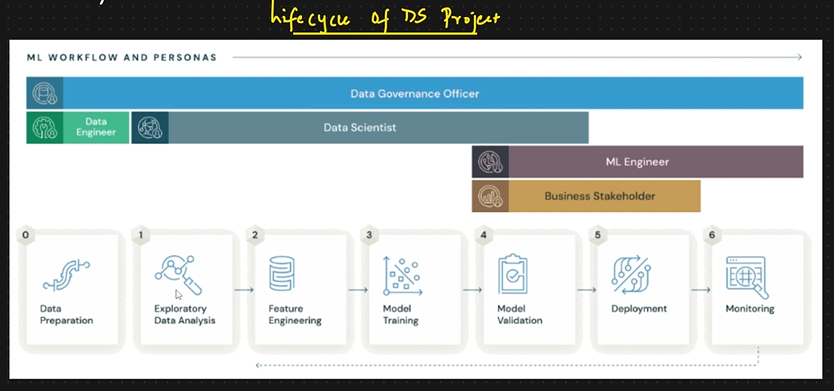

# MLFlow
End-to-End, open-source MLOps platform


1. Core components of MLFlow
2. Why Use MLFlow: Experiment Tracking and Hypothesis Testing
3. Who Uses MLFlow: Data Scientists
4. Usecase of MLFlow

### Lifecycle of DS Project
Data Preperation -> EDA -> FE -> Model Training -> Model Validation -> Deployment -> Monitoring



### Data Scientists Leverage MLFlow for:

1. Experimentat tracking and hypothesis testing
2. Code Structuring
3. Model packaging and dependency management
4. Evaluating hyperparameter tuning
5. Compare the results of model's retraining over time (i.e., versioning).


### MLFlow for MLOps Professional
1. Manage the lifecycle of trained models, both pre and post deployment.
2. Deploy models security to the production environment.
3. Manage deployment dependencies.


### Install MLFlow
Create venv.

```py
pip install mlflow
```

### MLFlow Tracking Server
In terminal type `mlflow ui` and hit enter. 