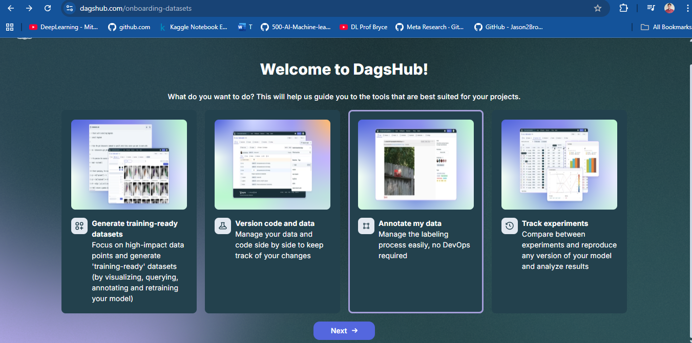
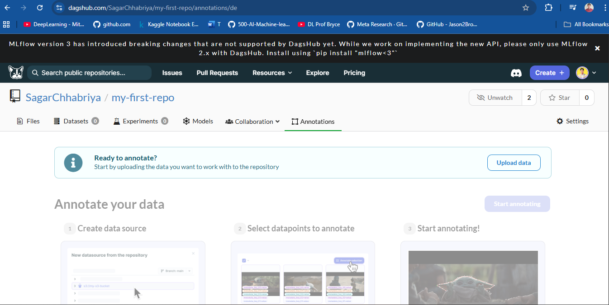
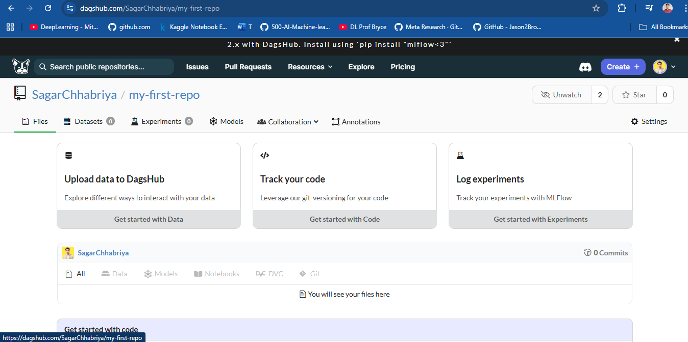
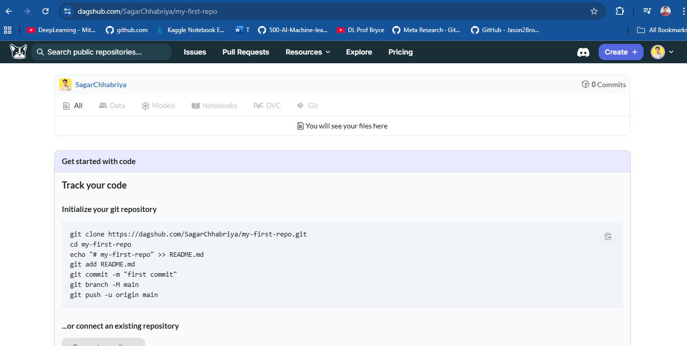
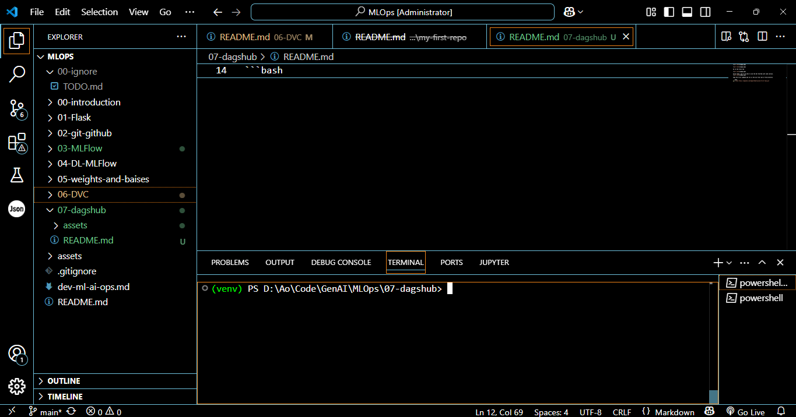
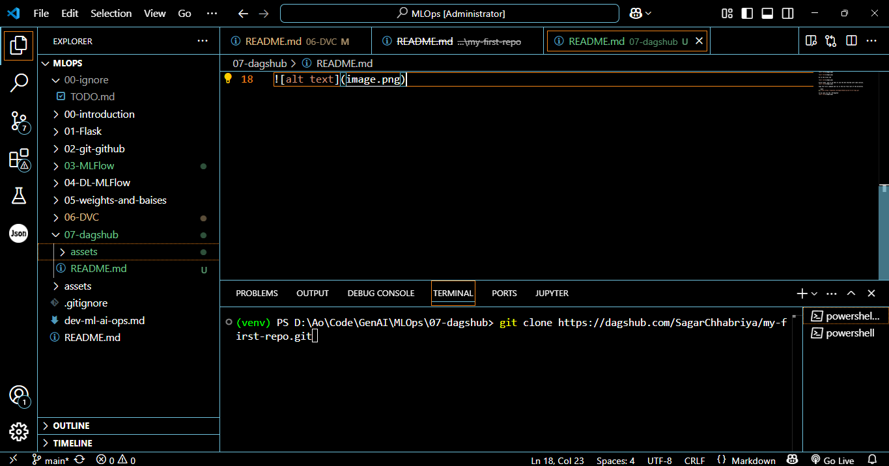
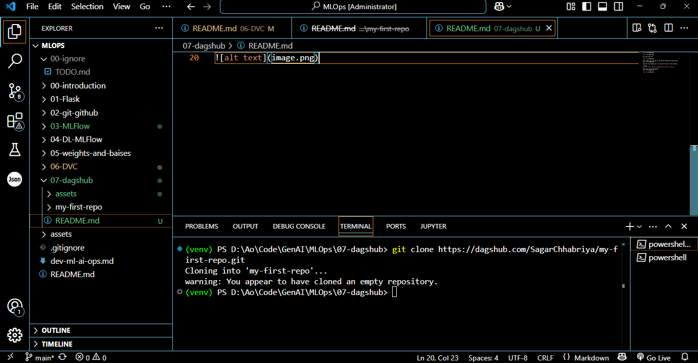
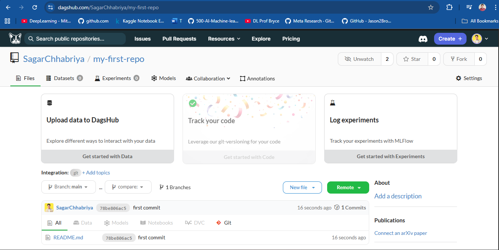
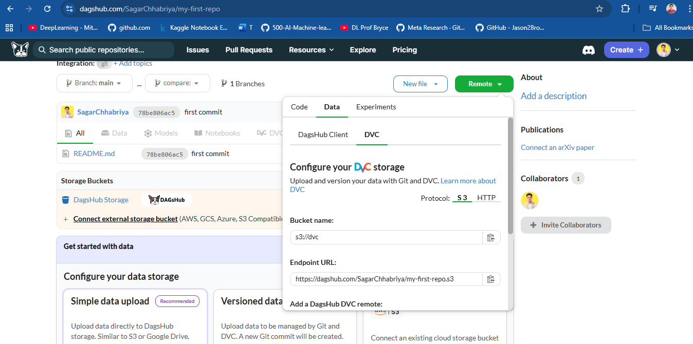
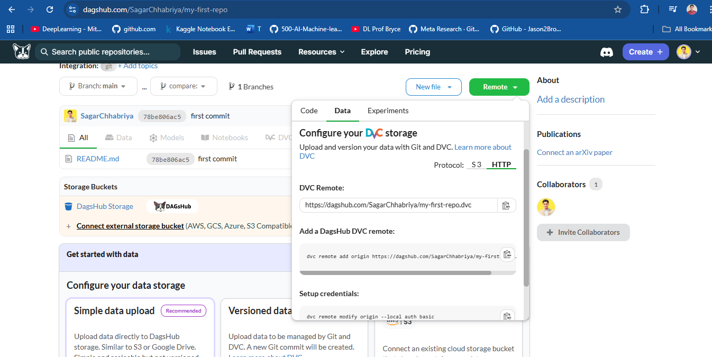

Copy the url and run it in the terminal inside the root directory


# 🚀 **Setting Up DVC with DagsHub: A Complete Guide**

## **Step 1: Clone Your DagsHub Repository**



Go to the **DagsHub dashboard** and select your repository (e.g., `my-first-repo`).




1. **Navigate to the Files tab** of the repository.




2. **Scroll down** to the **Get Started with Code** section.



3. Copy the first command and run it from the **root directory** of your local machine.

```bash
git clone https://dagshub.com/SagarChhabriya/my-first-repo.git
```

Here are the visuals 









> In your case, the repo name will be different.


## **Step 2: Set Up Git and Push Initial Code**

Once you’ve cloned the repo, follow these steps:


1. **Navigate into the cloned repo**:

   ```bash
   cd my-first-repo
   ```

2. **Create a `README.md` file**:

   ```bash
   echo "# my-first-repo" >> README.md
   ```

3. **Stage and commit your changes**:

   ```bash
   git add README.md
   git commit -m "first commit"
   ```

4. **Push the changes to DagsHub**:

   ```bash
   git branch -M main
   git push -u origin main
   ```

5. Refresh the DagsHub page and verify that the repo is now connected to the remote.




## **Step 3: Set Up Data Versioning with DVC**

### **3.1: Initialize DVC**

Inside your project’s root directory, initialize DVC:

```bash
dvc init
```

Then, commit the DVC files:

```bash
git add .dvc .dvcignore
git commit -m "Initialize DVC"
```

### **3.2: Add Your Data File**

1. **Create a `data/` directory** (if not already present) and move your dataset, e.g., `data.csv`, into it.

2. **Track the data file with DVC**:

   ```bash
   dvc add data/data.csv
   ```

3. **Commit the changes** (DVC tracking file and `.gitignore`):

   ```bash
   git add data/data.csv.dvc .gitignore
   git commit -m "Add data with DVC"
   ```


## **Step 4: Set Up DVC Remote Storage on DagsHub**

1. **Navigate to the DagsHub repo** and click the **green "Remote" button**.

    


2. Select **Data** from the options (Code, Data, Experiments), and choose **DVC**.

3. **Select the Protocol: HTTP**.

    


4. **Add the remote** in your terminal:

   ```bash
   dvc remote add origin https://dagshub.com/SagarChhabriya/my-first-repo.dvc
   dvc remote modify origin --local auth basic
   dvc remote modify origin --local user SagarChhabriya
   dvc remote modify origin --local password <your_token>
   dvc remote default origin
   ```

> **Note**: Replace `<your_token>` with your actual DagsHub token. You can generate one from [your DagsHub account settings](https://dagshub.com/user/settings/tokens).


## **Step 5: Push Data to DagsHub**

Finally, push your data to DagsHub's remote storage:

```bash
dvc push
```


## **Step 6: Verify the Setup**

* Refresh the DagsHub page to ensure the data has been uploaded correctly.
* You’ll now be able to see both your code (in Git) and data (tracked with DVC) on DagsHub.


## **Additional Notes for Collaboration**

If you're working in a team, collaborators can run the following to get started:

1. **Clone the repo**:

   ```bash
   git clone https://dagshub.com/SagarChhabriya/my-first-repo.git
   ```

2. **Install DVC**:

   ```bash
   pip install dvc[http]
   ```

3. **Pull the data**:

   ```bash
   dvc pull
   ```


This workflow ensures that:

* Your **code** is tracked with **Git**.
* Your **data** is versioned and managed using **DVC**.
* Both are integrated and accessible from **DagsHub**.

